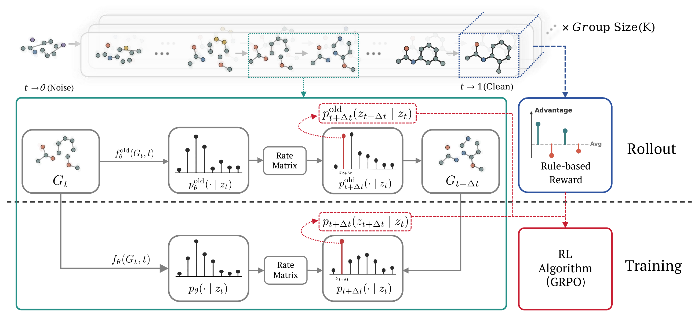

<div align="center">

# Graph-GRPO: Training Graph Flow Models with Reinforcement Learning

[](https://arxiv.org/abs/2603.10395)
[](https://icml.cc/Conferences/2026)
[](LICENSE)
[](https://www.python.org/downloads/release/python-3120/)
[](https://pytorch.org/)

**[Baoheng Zhu](#)\*¹**, &nbsp;
**[Deyu Bo](#)\*²**, &nbsp;
**[Delvin Ce Zhang](#)³**, &nbsp;
**[Xiao Wang](#)⁴**

¹Beijing University of Posts and Telecommunications &nbsp;·&nbsp;
²National University of Singapore &nbsp;·&nbsp;
³University of Sheffield &nbsp;·&nbsp;
⁴Beihang University



<sub><b>Figure.</b> Overview of Graph-GRPO. The rollout phase generates K denoising trajectories from a shared noisy graph; the RL training phase optimizes a GRPO objective on the cached analytic transition probabilities. See <a href="https://arxiv.org/abs/2603.10395">paper</a> for details.</sub>

</div>

---

## TL;DR

Graph-GRPO is an online RL framework for **aligning graph flow models (GFMs) with verifiable rewards**. It derives an **analytic transition probability** that makes GFM rollouts fully differentiable (replacing Monte Carlo sampling of DeFoG), and pairs it with an **iterative refinement strategy** that explores high-potential regions of chemical space. With only **50 denoising steps**, Graph-GRPO reaches **95.0 / 97.5 V.U.N.** on Planar / Tree and achieves SOTA on the **PMO** and **structure-based docking** benchmarks.

## Highlights

- **Analytic rate matrix** (Eq. 28): closed-form, differentiable transition probability that aligns sampling with training and unlocks PPO-style importance ratios on GFMs.
- **Refinement strategy**: iterative renoise → regenerate around the top-M reward pool — substantially improves sample efficiency on hard tasks (e.g. Valsartan SMARTS, Thiothixene Rediscovery).
- **Non-parametric adaptive prior**: dynamic node-type / edge-type / graph-size distributions, updated by EMA from a global reward buffer (no extra gradient updates to the denoiser).
- **End-to-end SOTA** on 23 PMO oracles, 5 docking targets (`parp1`, `fa7`, `5ht1b`, `braf`, `jak2`), and synthetic graph generation (Planar, Tree).

---

## Quick Start

### 1. Install

```bash
git clone https://github.com/Zhubaoheng/Graph-GRPO.git
cd Graph-GRPO
conda env create -f environment.yaml
conda activate graph-grpo
export LD_LIBRARY_PATH="$CONDA_PREFIX/lib${LD_LIBRARY_PATH:+:$LD_LIBRARY_PATH}"
python -m pip install pytdc==1.1.15 --no-deps     # PyTDC oracles
python -m pip install fcd==1.2 --no-deps          # only if dataset.compute_fcd=true

# compile the ORCA orbit-counting evaluator (needed for synthetic graph tasks)
cd src/analysis/orca && g++ -O2 -std=c++11 -o orca orca.cpp && cd ../../..
```

Tested on **Python 3.12 + PyTorch 2.8 + CUDA 12.8** on a single NVIDIA RTX PRO 6000 (Blackwell, 96GB). For docking tasks install Vina + OpenBabel via conda-forge: `conda install -c conda-forge openbabel vina`.

### 2. Download pretrained GFM checkpoint

The base GFM is a [DeFoG](https://github.com/manuelmlmadeira/DeFoG)-style discrete flow model pretrained on ZINC250k (for molecular tasks) or on the corresponding synthetic dataset (for Planar / Tree). Place it under `checkpoint/<task>.ckpt`. Drop-in pretrained weights from the DeFoG release work directly.

> **Checkpoints coming soon.** All pretrained and RL-finetuned task checkpoints will be released shortly.

### 3. Run a task

```bash
# train on a PMO oracle, then evaluate the checkpoint
python src/train_flow_grpo.py +experiment=zinc +grpo=drd2 \
    +grpo.pretrained_checkpoint=checkpoint/zinc.ckpt
python scripts/run_mol_opt.py --oracle DRD2 --ckpt outputs/<run>/last.ckpt --seed 0
```

The sections below cover every training and evaluation entry point in detail.

---

## Training

All training goes through one entry point — `src/train_flow_grpo.py`, driven by Hydra.
Pick a task with `+grpo=<config>` (configs live in `configs/grpo/`); the `+grpo` config
also selects the dataset, so `+experiment=` only chooses the architecture preset.
Single-GPU wall-clock matches paper Appendix C.1: ~5 h per synthetic task, ~20 h per
molecular task on an RTX PRO 6000.

### Molecular optimization — 23 PMO / TDC oracles

```bash
python src/train_flow_grpo.py \
    +experiment=zinc +grpo=<oracle> \
    +grpo.pretrained_checkpoint=checkpoint/zinc.ckpt
```

| Category | `+grpo=` configs |
|---|---|
| Single-objective | `qed`, `drd2`, `gsk3b`, `jnk3` |
| Multi-property (MPO) | `amlodipine_mpo`, `fexofenadine_mpo`, `osimertinib_mpo`, `perindopril_mpo`, `sitagliptin_mpo`, `zaleplon_mpo`, `ranolazine_mpo` |
| Similarity | `albuterol_similarity`, `mestranol_similarity` |
| Rediscovery | `celecoxib_rediscovery`, `thiothixene_rediscovery`, `troglitazone_rediscovery` |
| Scaffold | `deco_hop`, `scaffold_hop` |
| Multi-objective | `median1`, `median2` |
| Isomers | `isomers_c7h8n2o2`, `isomers_c9h10n2o2pf2cl` |
| SMARTS | `valsartan_smarts` (+ `valsartan_smarts_easy` warm-up — see below) |

**Valsartan SMARTS** uses a manual two-stage curriculum (Appendix F.2):

```bash
# Stage 1 — structural warm-up (~1k steps)
python src/train_flow_grpo.py +experiment=zinc +grpo=valsartan_smarts_easy \
    +grpo.pretrained_checkpoint=checkpoint/zinc.ckpt
# Stage 2 — full geometric-mean reward, resumed from Stage 1
python src/train_flow_grpo.py +experiment=zinc +grpo=valsartan_smarts \
    +grpo.resume_from_checkpoint=outputs/<stage1>/last.ckpt
```

### Lead optimization — 5 docking targets

Structure-based optimization scored with AutoDock Vina. Place receptor files at
`data/lead_opt/docking/{parp1,braf,jak2,fa7,5ht1b}.pdbqt` and seed molecules in
`data/lead_opt/docking/actives.csv` (`target`, `smiles` columns) before running.

```bash
python src/train_flow_grpo.py \
    +experiment=zinc +grpo=lead_opt_<target> \
    +grpo.pretrained_checkpoint=checkpoint/zinc.ckpt
```

`<target>` ∈ `parp1`, `braf`, `jak2`, `fa7`, `5ht1b`.

### Synthetic graph generation — Planar / Tree / SBM

```bash
python src/train_flow_grpo.py +experiment=planar +grpo=planar \
    +grpo.pretrained_checkpoint=checkpoint/planar.ckpt
python src/train_flow_grpo.py +experiment=tree +grpo=tree \
    +grpo.pretrained_checkpoint=checkpoint/tree.ckpt
python src/train_flow_grpo.py +experiment=sbm +grpo=sbm \
    +grpo.pretrained_checkpoint=checkpoint/sbm.ckpt
```

The REINFORCE baseline (no analytic rate matrix, paper Table 6):

```bash
python src/train_flow_grpo.py +experiment=tree +grpo=tree_reinforce \
    +grpo.pretrained_checkpoint=checkpoint/tree.ckpt
```

---

## Evaluation

### PMO benchmark — `scripts/run_mol_opt.py`

Runs the mol_opt protocol in-process — no external repo or extra environment.

```bash
# single oracle
python scripts/run_mol_opt.py --oracle DRD2 --ckpt <ckpt> --seed 0

# several oracles, several seeds
python scripts/run_mol_opt.py --oracle QED DRD2 GSK3B --ckpt <ckpt> --seed 0 1 2

# all 23 oracles with one shared checkpoint
python scripts/run_mol_opt.py --batch --ckpt <ckpt> --seed 0

# all 23 oracles with per-oracle checkpoints (looks for <dir>/<oracle>.ckpt)
python scripts/run_mol_opt.py --batch --ckpt-dir checkpoint/ --seed 0
```

| Flag | Description | Default |
|---|---|---|
| `--oracle NAME [NAME ...]` | oracle(s) to evaluate | — |
| `--batch` | run all 23 PMO oracles | off |
| `--ckpt PATH` / `--ckpt-dir DIR` | shared checkpoint / per-oracle directory | — |
| `--seed N [N ...]` | random seed(s) | `0` |
| `--max-oracle-calls N` | oracle budget per task | `10000` |
| `--screen-mode` + `--screen-csv PATH` | prescreening from a ZINC CSV | off |
| `--disable-refine` | turn off inference-time refinement | off |
| `--force-static-p0` | freeze the prior to the dataset default | off |
| `--output-dir DIR` | results directory | `results/mol_opt` |

Per-task results land in `<output-dir>/<oracle>_<seed>/`; batch runs also write `summary.csv`.

### Docking evaluation — `src/eval_grpo_sampler.py gdpo_eval`

Samples molecules from a checkpoint and scores them with AutoDock Vina, using the
same `data/lead_opt/docking/` assets as lead-optimization training.

```bash
python src/eval_grpo_sampler.py gdpo_eval \
    --ckpt checkpoint/lead_opt_parp1.ckpt \
    --grpo-config configs/grpo/lead_opt_parp1.yaml \
    --num-samples 2048 --seed 0 \
    --out-dir results/gdpo_eval_parp1
```

### Synthetic graph / test-only sampling

Score a checkpoint's V.U.N. and graph-statistics metrics. For synthetic graphs the
`dataset=` group must be set explicitly:

```bash
python src/main.py +experiment=planar dataset=planar \
    general.test_only=checkpoint/planar.ckpt
```

For molecular checkpoints, test-only sampling runs through the training entry point:

```bash
python src/train_flow_grpo.py +experiment=zinc +grpo=drd2 \
    general.test_only=<ckpt>
```

---

## Ablations

The mol_opt flags compose into the paper's ablation grid — refinement on/off,
prescreening on/off, dynamic vs. static prior:

```bash
# refinement off
python scripts/run_mol_opt.py --batch --ckpt-dir checkpoint/ --seed 0 1 2 --disable-refine
# prescreening on
python scripts/run_mol_opt.py --batch --ckpt-dir checkpoint/ --seed 0 1 2 \
    --screen-mode --screen-csv data/zinc/zinc250k.csv
# static prior
python scripts/run_mol_opt.py --batch --ckpt-dir checkpoint/ --seed 0 1 2 --force-static-p0
```

The dynamic-prior ablation (paper Table 4) is wrapped in a script:

```bash
bash scripts/run_p1_dynamic_p0_ablation.sh
```

---

## Acknowledgements

Graph-GRPO is built on top of excellent open-source work, and we are grateful to their authors:

- **DeFoG** — discrete flow matching backbone for graph generation: https://github.com/manuelmlmadeira/DeFoG
- **Flow-GRPO** — flow-matching reinforcement learning: https://github.com/yifan123/flow_grpo
- **mol_opt** — Practical Molecular Optimization benchmark (vendored under `src/mol_opt/`): https://github.com/wenhao-gao/mol_opt
- **GDPO** — graph diffusion policy optimization for lead optimization: https://github.com/sail-sg/GDPO
- **PyTDC** — Therapeutics Data Commons oracle suite: https://github.com/mims-harvard/TDC
- **AutoDock Vina** — molecular docking engine: https://github.com/ccsb-scripps/AutoDock-Vina
